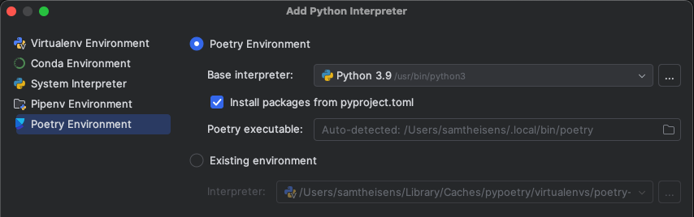

# intellij-polyglot
Demonstrates how Intellij ultimate can be used for polyglot projects.
And an apparent bug that breaks the Python facet on the root module.

## Reproduction steps
1. Open the project (folder) in Intellij Ultimate
2. Add a Python interpreter to Python facet under `intellij-polyglot`

3. Create a new Poetry Environment

4. On the CLI, run: `poetry install`
5. Open [hello.py](poetry/demo/hello.py) and validate that the imports, both 3rd party (`rich.console`) and local (`poetry.local.greeter`) can be clicked through.

6. Reload gradle
7. Navigate back to [hello.py](poetry/demo/hello.py) and observe that the referenced 3rd party dependencies are no longer accessible.


The library type `oderEntry` is removed from `intellij-polyglot.iml`
```xml
    <orderEntry type="library" name="Poetry (intellij-polyglot) (2) interpreter library" level="application" />
```

